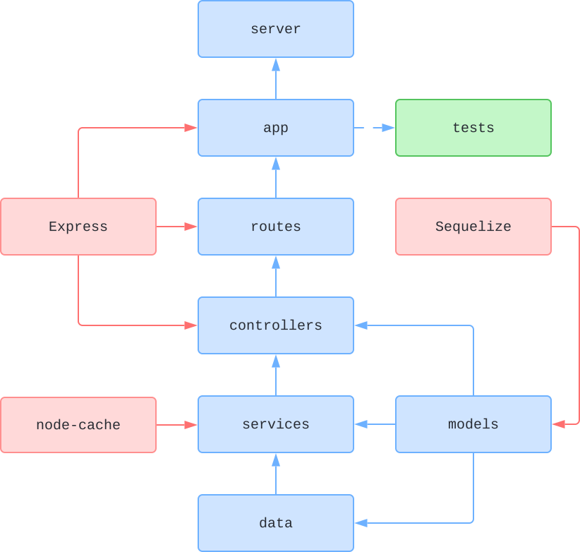
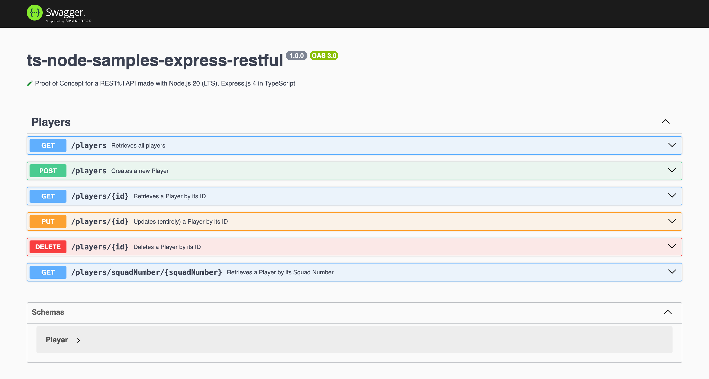

# 🧪 RESTful API with Node.js and Express.js in TypeScript

## Status

[](https://github.com/nanotaboada/ts-node-samples-express-restful/actions/workflows/node.js.yml)
[](https://sonarcloud.io/summary/new_code?id=nanotaboada_ts-node-samples-express-restful)
[](https://app.codacy.com/gh/nanotaboada/ts-node-samples-express-restful/dashboard?utm_source=gh&utm_medium=referral&utm_content=&utm_campaign=Badge_grade)
[](https://codecov.io/gh/nanotaboada/ts-node-samples-express-restful)
[](https://www.codefactor.io/repository/github/nanotaboada/ts-node-samples-express-restful)
[](https://codebeat.co/projects/github-com-nanotaboada-ts-node-samples-express-restful-master)

## About

Proof of Concept for a RESTful API made with [Node.js](https://nodejs.org/) [LTS/Jod](https://nodejs.org/en/blog/release/v22.11.0) and [Express.js](https://expressjs.com/) 4 in [TypeScript](https://www.typescriptlang.org/).

## Structure



_Figure: Simplified, conceptual project structure and main application flow. Not all dependencies are shown._

## Install

```console
npm install
```

## Run

```console
npm run dev
```

By default the application server will start as follows:

```console
> ts-node-samples-express-restful@1.0.0 dev
> nodemon

[nodemon] to restart at any time, enter `rs`
[nodemon] watching path(s): src/**/*
[nodemon] watching extensions: ts
[nodemon] starting `ts-node ./src/server.ts`
[server]: Server is running at http://localhost:9000
```

You can change the port by setting the `PORT` environment variable in the `.env` file.

```console
# /.env
PORT=9999
```

## Documentation

```console
http://localhost:9000/swagger/
```



## Container

This project includes a multi-stage `Dockerfile` for local development and production builds.

### Build the image

```bash
docker build -t ts-node-samples-express-restful .
```

### Run the container

```bash
docker run -p 9000:9000 ts-node-samples-express-restful:latest
```

## Credits

The solution has been coded using [Visual Studio Code](https://code.visualstudio.com/).

## Terms

All trademarks, registered trademarks, service marks, product names, company names, or logos mentioned on this repository are the property of their respective owners. All usage of such terms herein is for identification purposes only and constitutes neither an endorsement nor a recommendation of those items. Furthermore, the use of such terms is intended to be for educational and informational purposes only.
