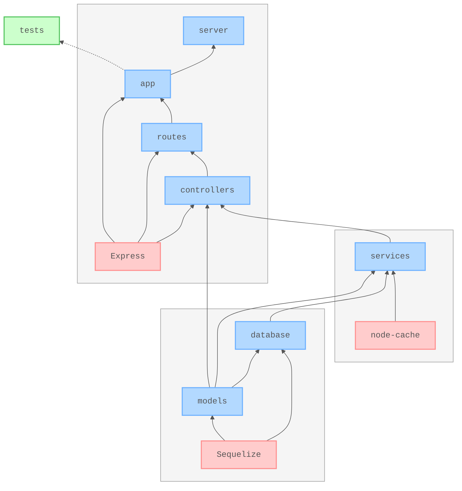

# 🧪 RESTful API with Node.js and Express.js in TypeScript

[](https://github.com/nanotaboada/ts-node-samples-express-restful/actions/workflows/node.js.yml)
[](https://sonarcloud.io/summary/new_code?id=nanotaboada_ts-node-samples-express-restful)
[](https://app.codacy.com/gh/nanotaboada/ts-node-samples-express-restful/dashboard?utm_source=gh&utm_medium=referral&utm_content=&utm_campaign=Badge_grade)
[](https://codecov.io/gh/nanotaboada/ts-node-samples-express-restful)
[](https://www.codefactor.io/repository/github/nanotaboada/ts-node-samples-express-restful)
[](https://opensource.org/licenses/MIT)

Proof of Concept for a RESTful API made with [Node.js](https://nodejs.org/) [LTS/Krypton (v24)](https://nodejs.org/en/blog/release/v24.11.1) and [Express.js](https://expressjs.com/) 5 in [TypeScript](https://www.typescriptlang.org/). Manage football player data with SQLite, Sequelize ORM, Swagger documentation, and in-memory caching.

## Table of Contents

- [Features](#features)
- [Tech Stack](#tech-stack)
- [Project Structure](#project-structure)
- [Architecture](#architecture)
- [API Endpoints](#api-endpoints)
- [Prerequisites](#prerequisites)
- [Quick Start](#quick-start)
- [Testing](#testing)
- [Docker](#docker)
- [Environment Variables](#environment-variables)
- [Available Scripts](#available-scripts)
- [Contributing](#contributing)
- [Legal](#legal)

## Features

- 🔌 RESTful CRUD operations for football player data
- 💿 Relational database with ORM
- ⚡ In-memory caching (1-hour TTL)
- 📚 Interactive API documentation
- 🔒 Security headers and CORS
- 🩺 Health check endpoint for monitoring
- ✅ Comprehensive integration tests
- 🐳 Full containerization support
- 📃 TypeScript strict mode enabled
- 🔄 Hot reload for development

## Tech Stack

| Category             | Technology |
|----------------------|------------|
| **Runtime**          | [Node.js 24 (LTS/Krypton)](https://github.com/nodejs/node) |
| **Language**         | [TypeScript 5.9](https://github.com/microsoft/TypeScript) |
| **Module System**    | Native ECMAScript Modules (ESM) - uses [tsx](https://github.com/privatenumber/tsx) for execution |
| **Framework**        | [Express.js 5](https://github.com/expressjs/express) |
| **Database**         | [SQLite3](https://github.com/sqlite/sqlite) with [Sequelize ORM](https://github.com/sequelize/sequelize) |
| **Caching**          | [node-cache](https://github.com/node-cache/node-cache) |
| **Documentation**    | [Swagger (OpenAPI 3.0)](https://github.com/swagger-api/swagger-ui) |
| **Security**         | [Helmet](https://github.com/helmetjs/helmet), [CORS](https://github.com/expressjs/cors) |
| **Testing**          | [Jest 30](https://github.com/jestjs/jest) with [Supertest](https://github.com/ladjs/supertest) |
| **Containerization** | [Docker](https://github.com/docker) with multi-stage builds |
| **Code Quality**     | [ESLint](https://github.com/eslint/eslint), [Prettier](https://github.com/prettier/prettier), [Commitlint](https://github.com/conventional-changelog/commitlint) |
| **Dev Tools**        | [tsx](https://github.com/privatenumber/tsx) (TypeScript executor), [nodemon](https://github.com/remy/nodemon) |

> 💡 **Note:** While the repository name references `ts-node` (the original implementation), the project now uses [tsx](https://github.com/privatenumber/tsx) for faster, cleaner TypeScript execution without experimental flags.

## Project Structure

```text
src/
├── app.ts              # Express app setup & middleware configuration
├── server.ts           # HTTP server initialization & lifecycle
├── controllers/        # Request handlers with Swagger annotations
├── services/           # Business logic + caching layer
├── database/           # Sequelize DB access (interfaces + implementations)
├── models/             # Sequelize models (Player)
├── routes/             # Express Router definitions
├── docs/               # Swagger configuration & doc generation
└── middlewares/        # Custom middleware (swagger CSP)

tests/                  # Integration tests with supertest
scripts/                # Docker entrypoint & healthcheck scripts
storage/                # Pre-seeded SQLite database
```

## Architecture

Layered architecture with dependency injection via constructors and interface-based contracts.



_Simplified, conceptual project structure and main application flow. Not all dependencies are shown._

## API Endpoints

Interactive API documentation is available via Swagger UI at `http://localhost:9000/swagger/` when the server is running.

**Quick Reference:**

- `GET /players` - List all players
- `GET /players/:id` - Get player by ID
- `GET /players/squadNumber/:squadNumber` - Get player by squad number
- `POST /players` - Create new player
- `PUT /players/:id` - Update player
- `DELETE /players/:id` - Remove player
- `GET /health` - Health check

For complete endpoint documentation with request/response schemas, explore the [interactive Swagger UI](http://localhost:9000/swagger/). You can also access the OpenAPI JSON specification at `http://localhost:9000/swagger.json`.

## Prerequisites

Before you begin, ensure you have the following installed:

- Node.js 24 (LTS/Krypton) or higher
- npm (comes with Node.js)
- Docker and Docker Compose (optional, for containerized setup)

## Quick Start

### Clone the repository

```bash
git clone https://github.com/nanotaboada/ts-node-samples-express-restful.git
cd ts-node-samples-express-restful
```

### Install dependencies

```bash
npm install
```

### Start the development server

```bash
npm run dev
```

The server will start on `http://localhost:9000` with the following output:

```console
> ts-node-samples-express-restful@1.0.0 dev
> nodemon

[nodemon] to restart at any time, enter `rs`
[nodemon] watching path(s): src/**/*
[nodemon] watching extensions: ts
[nodemon] starting `tsx ./src/server.ts`
🚀 Running at http://localhost:9000
```

### Access the application

- API: `http://localhost:9000`
- Swagger Documentation: `http://localhost:9000/swagger/`
- Health Check: `http://localhost:9000/health`

## Testing

Run the test suite with Jest:

```bash
# Run all tests
npm test

# Run tests with coverage report
npm run coverage

# Run linter
npm run lint

# Validate commit message format
npm run lint:commit
```

Tests are located in the `tests/` directory and use Supertest for integration testing. Coverage reports are generated for controllers, services, and routes only.

## Docker

This project includes full Docker support with multi-stage builds and Docker Compose for easy deployment.

### Build the Docker image

```bash
npm run docker:build
# or
docker compose build
```

### Start the application

```bash
npm run docker:up
# or
docker compose up
```

> 💡 **Note:** On first run, the container copies a pre-seeded SQLite database into a persistent volume. On subsequent runs, that volume is reused and the data is preserved.

### Stop the application

```bash
npm run docker:down
# or
docker compose down
```

### Reset the database

To remove the volume and reinitialize the database from the built-in seed file:

```bash
docker compose down -v
```

The containerized application runs on port 9000 and includes health checks that monitor the `/health` endpoint every 30 seconds.

## Environment Variables

Create a `.env` file in the root directory to customize configuration:

```env
# Server port (default: 9000)
PORT=9000

# Database storage path (default: storage/players-sqlite3.db)
# In Docker: /storage/players-sqlite3.db
STORAGE_PATH=storage/players-sqlite3.db
```

## Available Scripts

| Script                 | Description                                       |
|------------------------|---------------------------------------------------|
| `npm run dev`          | Start development server with hot reload          |
| `npm start`            | Run compiled application from `dist/`             |
| `npm run build`        | Compile TypeScript to JavaScript                  |
| `npm test`             | Run Jest tests with --detectOpenHandles flag      |
| `npm run coverage`     | Generate test coverage report                     |
| `npm run lint`         | Run ESLint on all files                           |
| `npm run lint:commit`  | Validate last commit message format               |
| `npm run swagger:docs` | Generate swagger.json from JSDoc annotations      |
| `npm run docker:build` | Build Docker image                                |
| `npm run docker:up`    | Start Docker container                            |
| `npm run docker:down`  | Stop and remove Docker volume                     |

## Contributing

Contributions are welcome! Please read [CONTRIBUTING.md](CONTRIBUTING.md) for details on the code of conduct and the process for submitting pull requests.

Key guidelines:

- Follow [Conventional Commits](https://www.conventionalcommits.org/) for commit messages
- Ensure all tests pass (`npm test`)
- Run linter before committing (`npm run lint`)
- Keep changes small and focused

## Legal

This project is provided for educational and demonstration purposes and may be used in production environments at your discretion. All referenced trademarks, service marks, product names, company names, and logos are the property of their respective owners and are used solely for identification or illustrative purposes.
