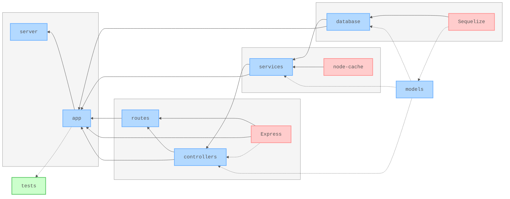

# 🧪 RESTful API with Node.js and Express.js in TypeScript

[](https://github.com/nanotaboada/ts-node-samples-express-restful/actions/workflows/node-ci.yml)
[](https://github.com/nanotaboada/ts-node-samples-express-restful/actions/workflows/node-cd.yml)
[](https://github.com/nanotaboada/ts-node-samples-express-restful/actions/workflows/codeql.yml)
[](https://sonarcloud.io/summary/new_code?id=nanotaboada_ts-node-samples-express-restful)
[](https://codecov.io/gh/nanotaboada/ts-node-samples-express-restful)
[](https://www.codefactor.io/repository/github/nanotaboada/ts-node-samples-express-restful)
[](https://opensource.org/licenses/MIT)


Proof of Concept for a RESTful Web Service built with **Express.js 5** and **TypeScript** targeting **Node.js 24 LTS**. This project demonstrates best practices for building a layered, testable, and maintainable API implementing CRUD operations for a Players resource (Argentina 2022 FIFA World Cup squad).

## Features

- 🏗️ **Layered Architecture** - Interface-based design with constructor injection and strict TypeScript
- 📚 **Interactive Documentation** - Live API exploration with Swagger UI and VS Code REST Client support
- ⚡ **Performance Caching** - In-memory caching with node-cache and Sequelize ORM
- 🔒 **Security Middleware** - Rate limiting, CORS, and Helmet headers
- 🐳 **Containerized Deployment** - Multi-stage Docker builds with migration-based database initialization
- 🔄 **Automated Pipeline** - Continuous integration with ESLint, Prettier, and automated testing

## Tech Stack

| Category               | Technology                                                                                                                   |
|------------------------|------------------------------------------------------------------------------------------------------------------------------|
| **Runtime**            | [Node.js 24 (LTS/Krypton)](https://github.com/nodejs/node)                                                                  |
| **Language**           | [TypeScript 5.9](https://github.com/microsoft/TypeScript)                                                                   |
| **Module System**      | Native ECMAScript Modules (ESM) - uses [tsx](https://github.com/privatenumber/tsx) for execution                           |
| **Framework**          | [Express.js 5](https://github.com/expressjs/express)                                                                        |
| **Database**           | [SQLite3](https://github.com/sqlite/sqlite) with [Sequelize ORM](https://github.com/sequelize/sequelize)                   |
| **Caching**            | [node-cache](https://github.com/node-cache/node-cache)                                                                      |
| **Documentation**      | [Swagger (OpenAPI 3.0)](https://github.com/swagger-api/swagger-ui)                                                          |
| **Security**           | [Helmet](https://github.com/helmetjs/helmet), [CORS](https://github.com/expressjs/cors), [express-rate-limit](https://github.com/express-rate-limit/express-rate-limit) |
| **Testing**            | [Jest 30](https://github.com/jestjs/jest) with [Supertest](https://github.com/ladjs/supertest)                             |
| **Containerization**   | [Docker](https://github.com/docker) with multi-stage builds                                                                 |
| **Code Quality**       | [ESLint](https://github.com/eslint/eslint), [Prettier](https://github.com/prettier/prettier), [Commitlint](https://github.com/conventional-changelog/commitlint) |
| **Dev Tools**          | [tsx](https://github.com/privatenumber/tsx) (TypeScript executor), [nodemon](https://github.com/remy/nodemon)              |

> 💡 **Note:** While the repository name references `ts-node` (the original implementation), the project now uses [tsx](https://github.com/privatenumber/tsx) for faster, cleaner TypeScript execution without experimental flags.

## Architecture

Layered architecture with dependency injection via constructors and interface-based contracts.


```mermaid
%%{init: {
  "theme": "default",
  "themeVariables": {
    "fontFamily": "Fira Code, Consolas, monospace",
    "textColor": "#555",
    "lineColor": "#555",
    "lineWidth": 2,
    "clusterBkg": "#f5f5f5",
    "clusterBorder": "#999"
  }
}}%%

graph RL

    tests[tests]

    subgraph Layer 1[" "]
        server[server]
        app[app]
    end

    subgraph Layer 2[" "]
        routes[routes]
        controllers[controllers]
        Express[Express]
    end

    subgraph Layer 3[" "]
        services[services]
        nodeCache[node-cache]
    end

    subgraph Layer 4[" "]
        database[database]
        Sequelize[Sequelize]
    end

    models[models]

    %% Dependencies

    app --> server
    routes --> app
    controllers --> routes
    services --> controllers
    database --> services

    Express --> routes
    nodeCache --> services
    Sequelize --> database

    Express --> app
    Express -.-> controllers
    Sequelize -.-> models

    app -.-> tests

    models -.-> database
    models -.-> services
    models -.-> controllers

    controllers --> app
    services --> app
    database --> app

    %% Styling
    classDef core fill:#b3d9ff,stroke:#6db1ff,stroke-width:2px,color:#555,font-family:monospace;
    classDef deps fill:#ffcccc,stroke:#ff8f8f,stroke-width:2px,color:#555,font-family:monospace;
    classDef test fill:#ccffcc,stroke:#53c45e,stroke-width:2px,color:#555,font-family:monospace;

    class server,app,routes,controllers,services,database,models core
    class Express,Sequelize,nodeCache deps
    class tests test
```

> *Arrows follow the injection direction (A → B means A is injected into B). Solid = runtime dependency, dotted = structural. Blue = core domain, red = third-party, green = tests.*

Significant architectural decisions are documented in [`docs/adr/`](docs/adr/).

## API Reference

Interactive API documentation is available via Swagger UI at `http://localhost:9000/swagger/` when the server is running.

| Method | Endpoint | Description | Status |
| ------ | -------- | ----------- | ------ |
| `GET` | `/players` | List all players | `200 OK` |
| `GET` | `/players/:id` | Get player by ID | `200 OK` |
| `GET` | `/players/squadNumber/:squadNumber` | Get player by squad number | `200 OK` |
| `POST` | `/players` | Create new player | `201 Created` |
| `PUT` | `/players/squadNumber/:squadNumber` | Update player by squad number | `204 No Content` |
| `DELETE` | `/players/squadNumber/:squadNumber` | Remove player by squad number | `204 No Content` |
| `GET` | `/health` | Health check | `200 OK` |

Error codes: `400 Bad Request` (validation failed) · `404 Not Found` (player not found) · `409 Conflict` (duplicate squad number on `POST`)

For complete endpoint documentation with request/response schemas, explore the [interactive Swagger UI](http://localhost:9000/swagger/). You can also access the OpenAPI JSON specification at `http://localhost:9000/swagger.json`.

Alternatively, use [`rest/players.rest`](rest/players.rest) with the [REST Client](https://marketplace.visualstudio.com/items?itemName=humao.rest-client) extension for VS Code to send requests directly from the editor.

## Prerequisites

Before you begin, ensure you have the following installed:

- Node.js (see `.nvmrc` for required version)
- npm (comes with Node.js)
- [direnv](https://direnv.net/) (optional, but recommended — auto-loads the correct Node.js version via `.nvmrc` on directory entry)
- Docker and Docker Compose (optional, for containerized setup)

## Quick Start

### Clone

```bash
git clone https://github.com/nanotaboada/ts-node-samples-express-restful.git
cd ts-node-samples-express-restful
```

### Install

```bash
npm install
```

### Run

```bash
npm run dev
```

The `predev` hook runs `db:migrate` first, then nodemon starts. On first run the database is created and seeded; on subsequent runs no pending migrations will be found and nodemon starts immediately:

```console
> ts-node-samples-express-restful@1.0.0 predev
> npm run db:migrate

Sequelize CLI [Node: 24.x.x, CLI: 6.x.x, ORM: 6.x.x]
Using environment "development".
== 20260101000001-create-players-table: migrated (0.007s)
== 20260101000002-seed-starting-11: migrated (0.004s)
== 20260101000003-seed-substitute-players: migrated (0.004s)

> ts-node-samples-express-restful@1.0.0 dev
> nodemon

[nodemon] to restart at any time, enter `rs`
[nodemon] watching path(s): src/**/*
[nodemon] watching extensions: ts
[nodemon] starting `tsx ./src/server.ts`
🚀 Running at http://localhost:9000
```

### Access

Once the application is running, you can access:

- **API Server**: `http://localhost:9000`
- **Swagger UI**: `http://localhost:9000/swagger/`
- **Health Check**: `http://localhost:9000/health`

## Containers

### Build and Start

```bash
npm run docker:up
# or
docker compose up
```

> 💡 **Note:** On first run, the container runs all Sequelize migrations to create and seed the database into the persistent volume. On subsequent runs, the volume is reused and only pending migrations are applied.

### Stop

```bash
npm run docker:down
# or
docker compose down
```

### Reset Database

To remove the volume and reinitialize the database from scratch:

```bash
docker compose down -v
```

### Pull Docker Images

Each release publishes multiple tags for flexibility:

```bash
# By semantic version (recommended for production)
docker pull ghcr.io/nanotaboada/ts-node-samples-express-restful:1.0.0

# By term name (memorable alternative)
docker pull ghcr.io/nanotaboada/ts-node-samples-express-restful:assist

# Latest release
docker pull ghcr.io/nanotaboada/ts-node-samples-express-restful:latest
```

## Database Migrations

Schema and seed data are managed as three sequential Sequelize CLI migrations:

| # | File | Type | Description |
|---|------|------|-------------|
| 1 | `20260101000001-create-players-table.js` | DDL | Creates the `players` table |
| 2 | `20260101000002-seed-starting-11.js` | DML | Seeds the 11 starting players |
| 3 | `20260101000003-seed-substitute-players.js` | DML | Seeds the 15 substitute players |

```bash
# Apply all pending migrations
npm run db:migrate

# Undo the most recent migration (removes substitutes)
npm run db:migrate:undo

# Undo all migrations (drops the table)
npm run db:migrate:undo:all

# Full reset: undo all, then re-apply from scratch
npm run db:reset
```

Sequelize tracks applied migrations in a `SequelizeMeta` table within the database. The split between DDL and DML migrations means each concern can be rolled back independently.

## Environment Variables

Create a `.env` file in the root directory to customize configuration:

```env
# Server port (default: 9000)
PORT=9000

# Database storage path (default: storage/players-sqlite3.db)
STORAGE_PATH=storage/players-sqlite3.db

# Rate limiting (all optional — defaults shown)
RATE_LIMIT_ENABLED=true
RATE_LIMIT_WINDOW_MS=60000
RATE_LIMIT_MAX_GENERAL=100
RATE_LIMIT_MAX_STRICT=20
```

## Contributing

Contributions are welcome! Please see [CONTRIBUTING.md](CONTRIBUTING.md) for details on:

- Code of Conduct
- Development workflow and best practices
- Commit message conventions (Conventional Commits)
- Pull request process and requirements

**Key guidelines:**

- Follow [Conventional Commits](https://www.conventionalcommits.org/) for commit messages
- Ensure all tests pass (`npm test`)
- Run linter before committing (`npm run lint`)
- Keep changes small and focused
- Review `.github/copilot-instructions.md` for architectural patterns

**Testing:**

Run the test suite with Jest + Supertest:

```bash
# Run all tests
npm test

# Run tests with coverage report
npm run coverage
```

## Command Summary

| Command | Description |
| ------- | ----------- |
| `npm run dev` | Start development server with hot reload |
| `npm start` | Run compiled application from `dist/` |
| `npm run build` | Compile TypeScript to JavaScript |
| `npm test` | Run Jest tests |
| `npm run coverage` | Generate test coverage report |
| `npm run lint` | Run ESLint on all files |
| `npm run lint:commit` | Validate last commit message format |
| `npm run swagger:docs` | Generate swagger.json from JSDoc annotations |
| `npm run db:migrate` | Apply all pending migrations |
| `npm run db:migrate:undo` | Undo the most recent migration |
| `npm run db:migrate:undo:all` | Undo all migrations |
| `npm run db:reset` | Undo all migrations and re-apply from scratch |
| `npm run docker:build` | Build Docker image |
| `npm run docker:up` | Start Docker container |
| `npm run docker:down` | Stop and remove Docker volume |
| **AI Commands** | |
| `/pre-commit` | Runs linting, tests, and quality checks before committing |
| `/pre-release` | Runs pre-release validation workflow |

## Legal

This project is provided for educational and demonstration purposes and may be used in production at your own discretion. All trademarks, service marks, product names, company names, and logos referenced herein are the property of their respective owners and are used solely for identification or illustrative purposes.
